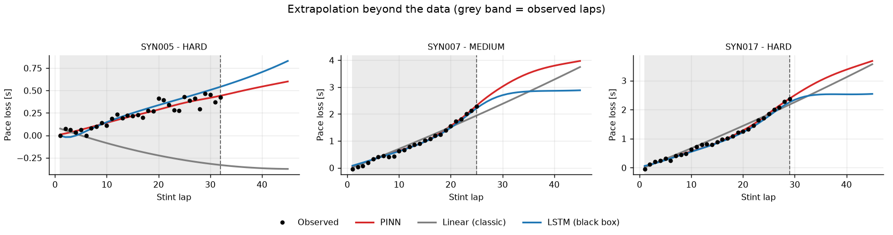
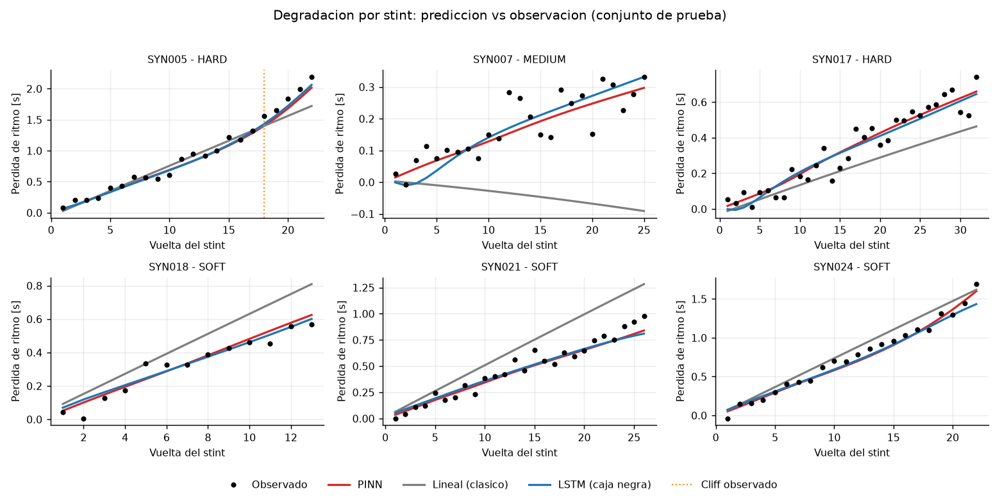
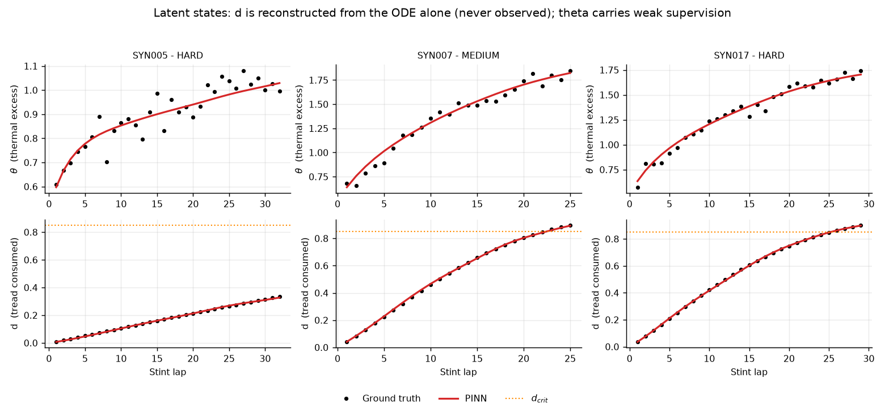
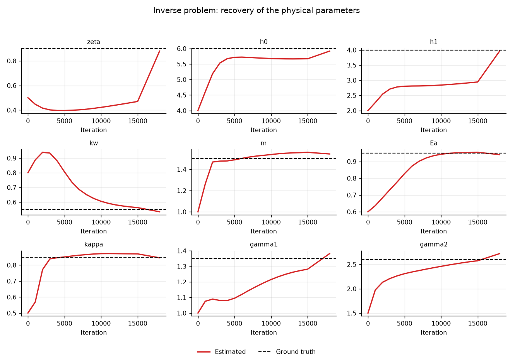
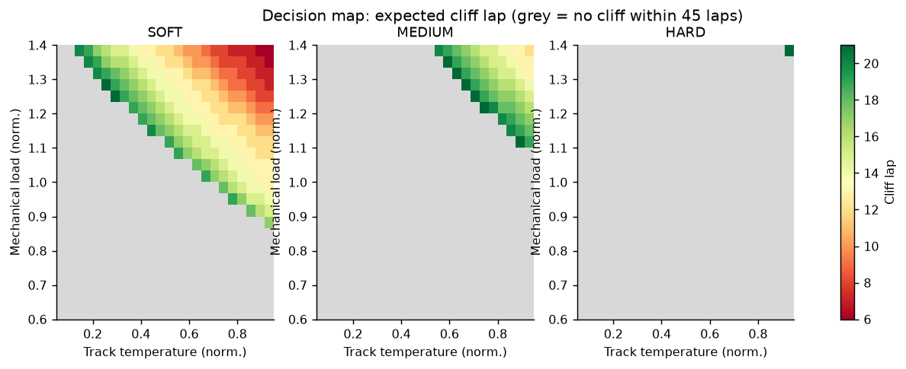

# F1 Tire PINN

A Physics-Informed Neural Network that predicts Formula 1 tire degradation and
the lap at which the performance **cliff** hits, built with **DeepXDE** on
PyTorch.

This is the modelling half of the project *Real-Time Prediction of Formula 1 Tire
Degradation using Physics-Informed Neural Networks*. **The AWS cloud layer is out
of scope**: what lives here is the physical system, the network, offline
training, the comparison baselines and the evaluation.



*The figure that sums up the whole project. The grey band is the observed laps;
to the right of the dashed line every model is extrapolating. In the left panel
the LSTM (blue) **bends downwards** — it predicts the tire regains grip, which is
thermodynamically impossible. In the middle panel the linear model (grey) goes
negative: it predicts the tire is faster than new. The PINN (red) keeps
integrating the differential equation and saturates where it should.*

---

## 1. The physical model

Two coupled dimensionless ODEs describe the life of a stint:

```
(E1)  dθ/dτ = A_gen · q · (1 + ζ·d)  −  (h₀ + h₁·v) · θ        thermal balance
(E2)  dd/dτ = k_w · λ^m · exp(E_a·(θ + T_trk) − κ·c) · (1 − d)  wear
```

| Symbol | Meaning | Source |
|---|---|---|
| `τ` | stint lap / `L_ref` | dimensionless time |
| `θ` | `(T_surface − T_track) / ΔT_ref` | **latent state**, never observed |
| `d` | fraction of tread consumed | **latent state**, never observed |
| `q` | specific frictional energy per lap | telemetry |
| `λ` | mean mechanical load in g | telemetry |
| `v` | mean speed (convective cooling) | telemetry |
| `T_trk` | normalised track temperature | session weather |
| `c` | compound hardness (0 soft … 1 hard) | timing |

**(E1)** is a lumped-capacitance heat balance: frictional generation minus
exponential surface decay. **(E2)** combines Archard's wear law with an
Arrhenius thermal activation — wear grows exponentially with temperature.

Two factors do the heavy lifting:

- **`(1 − d)` in (E2)** bounds `d ∈ [0,1]` *structurally*. You cannot consume more
  tread than exists. The physical bound is enforced by the equation itself, not by
  a penalty term.
- **`(1 + ζ·d)` in (E1)** is what drives the cliff: as the tread thins, the same
  frictional energy is deposited into less rubber → temperature rises → Arrhenius
  accelerates wear → the tread thins faster. It is positive feedback, so **the
  cliff emerges from the coupled dynamics instead of being hard-coded**. This is
  exactly the kind of constraint an LSTM has no way of knowing.

The measurable observable is not `d` but the pace loss:

```
δ(τ) = γ₁·d + γ₂·d^p        (p = 8)
```

`γ₁·d` is gradual degradation; `γ₂·d^p` is negligible until `d` approaches 1 and
then dominates — the grip collapse.

---

## 2. Why this PINN is parametric

A textbook PINN solves **one** trajectory: the network takes `t` and returns the
state. That would mean retraining for every stint, which is useless for live
inference. Here the network is a **solution operator**:

```
N(τ, q, λ, v, T_trk, c) → (θ, d)
```

It learns the entire *family* of solutions to the ODE across the full range of
race conditions, once. Predicting a new stint is **a single forward pass** — no
retraining, no integration. That is what makes the offline-training /
online-inference split viable.

### Loss function

| Term | What it enforces | Where |
|---|---|---|
| `L1` | residual of (E1) | the whole condition hypercube |
| `L2` | residual of (E2) | the whole condition hypercube |
| `L3` | bound `d ≤ d_max` | the whole hypercube |
| `L4` | fit to measured pace loss | observed points only |
| `L5` | temperature proxy (optional) | observed points only |

`L1`–`L3` are enforced **even where there is no data**, out to the full decision
horizon (45 laps by default) rather than just as far as the longest observed
stint. That is the edge over a black box: outside its training distribution, an
LSTM has nothing tying it to thermodynamics.

### Hard initial conditions

Imposed by output transform, not as loss terms:

```
θ(τ) = θ₀ + τ · N₀(x)          ⟹  θ(0) = θ₀ exactly
d(τ) = τ · softplus(N₁(x))     ⟹  d(0) = 0 exactly and d ≥ 0 always
```

This removes two loss terms, and with them the weight-balancing problem that is
the single most common cause of PINN convergence failures.

### Inverse problem

The physical coefficients (`ζ, h₀, h₁, k_w, m, E_a, κ, γ₁, γ₂`) are unknown: they
are estimated **jointly** with the network weights as `dde.Variable`. They are
parametrised in log space, so they are positive by construction — which is what
their physical meaning demands.

### The two degeneracies (and how they are closed)

This model has **two exactly degenerate directions**. Ignoring them does not
produce a mediocre fit — it produces divergence.

**1. Temperature scale.** If `A_gen`, the scale of `θ` and `E_a` were all free,
doubling `A_gen` and halving `E_a` would leave wear unchanged. Closed by
**fixing `A_gen`**, which anchors the thermal scale. Under `--source synthetic`
the weak temperature supervision (`L5`) helps too; with real data `L5` is
disabled automatically, because internal tire temperature is not public.

**2. Wear scale.** This is the dangerous one:

```
d → ε·d ,  γ₁ → γ₁/ε ,  γ₂ → γ₂/ε^p     leaves δ exactly unchanged
```

On the synthetic bench two things break it: the thermal proxy, and the stints
that saturate at `d = 1`. **With real data neither exists**, and the optimiser
slides along that direction until it overflows. This happened literally: a run on
Monza + Hungary ended with `γ₂ = 2.5 × 10¹³`, `k_w = 0.026` and a test RMSE of
5.8 × 10⁹ s — with a **low training loss** (0.117), because along the degenerate
direction the fit is perfect.

Closed by bounding `γ₁ ∈ [0.2, 4.0] s` and `γ₂ ∈ [0.2, 6.0] s` through a sigmoid
(`gamma1_bounds`, `gamma2_bounds` in `PhysicsConfig`). This is not numerical
caution: it asserts something we genuinely know — a destroyed tire costs a few
seconds a lap, not millions.

> The general lesson: in a PINN with an inverse problem, **a low training loss
> guarantees nothing** if the model has degenerate directions. You have to
> enumerate them and close them explicitly.

---

## 3. Installation

```bash
python -m venv .venv
.venv\Scripts\activate
pip install torch --index-url https://download.pytorch.org/whl/cpu
pip install -r requirements.txt
```

DeepXDE needs to know its backend:

```bash
set DDE_BACKEND=pytorch
```

---

## 4. Usage

Train on the synthetic bench (needs no network access and no API):

```bash
python run_train.py --source synthetic --stints 64
```

Quick pipeline check (about 2 minutes):

```bash
python run_train.py --source synthetic --quick
```

Train on real telemetry. **Use several races**: within a single one the context
variables barely move (same circuit, same weather), so the network only really
sees the effect of compound and time.

```bash
python run_train.py --source fastf1 --year 2023 --gp Monza Hungary Bahrain Spain
```

Inference and latency measurement with a trained model:

```bash
python run_infer.py --compound SOFT --track-temp 0.8 --load 1.2
```

### Outputs in `outputs/`

| File | Contents |
|---|---|
| `01_stints.png` | predicted vs observed curves, test stints |
| `02_extrapolation.png` | behaviour beyond the data: PINN vs black box |
| `03_latent_states.png` | `θ` and `d` reconstructed vs synthetic ground truth |
| `04_parameters.png` | inverse-problem convergence |
| `05_loss.png` | evolution of each loss term |
| `06_cliff_map.png` | decision map: lap at `d_crit` by compound and conditions |
| `report.txt` | metrics table and parameter recovery |
| `pinn_weights.pt`, `pinn_params.json` | trained model, ready for inference |

---

## 5. The synthetic bench

`data_synthetic.py` integrates (E1)–(E2) with **known** parameters
(`physics.GROUND_TRUTH`) and adds measurement noise. It serves two purposes:

1. The pipeline runs without depending on the network or on FastF1.
2. **It validates the inverse problem**: the PINN starts from deliberately wrong
   initial values and must *recover* the true ones using only the observed pace
   loss. With real data that check is impossible — there is no ground truth.

The generator imitates a strategist's decision: the stint is cut **two to five
laps after** the cliff. No team runs a destroyed tire, but no team stops at the
exact instant either — they lose laps deciding, waiting for a pit window, or
covering a rival.

That margin matters more than it looks. Those are the only laps that carry
information about the `d → 1` regime, which is what `γ₂` and the scale of `k_w`
depend on. Cutting the stint exactly at the cliff gave a mean parameter-recovery
error of **11.8 %** (`γ₂` off by 62 %); leaving those few extra laps brings it
down to **2.1 %** (`γ₂` off by 4.7 %).

---

## 6. Real data: what is observable and what is not

**Nothing the model needs is directly observable.** Internal temperature,
vertical load and tread state are proprietary to each team. What is public is
onboard telemetry and lap timing. `data_fastf1.py` bridges that gap:

- **`q_fric`** — specific frictional power, integrating `|a|·v` over the lap. This
  is the heat-generation term of (E1).
- **`load`** — mean total acceleration in g. This is the Archard term of (E2).
- **`speed`** — mean speed, which governs convective cooling.

**Lateral acceleration is not in the telemetry**: it is reconstructed by
differentiating the GPS trajectory twice, with Savitzky-Golay smoothing first
because numerical second derivatives amplify sampling noise.

The degradation observable is pace loss **corrected for fuel**: a car sheds
~100 kg over a race and that is worth more than a second a lap. Uncorrected, the
weight loss completely masks degradation.

Quality filters applied: green flag only (`TrackStatus == 1`), no in/out laps,
`IsAccurate` only, no deleted laps, and fresh sets only (`FreshTyre`) — because
`d(0) = 0` only holds for a new tire.

The proxies are made dimensionless against **fixed references** (`q_fric_ref`,
`load_ref`, `speed_ref` in `DataConfig`), not against each session's median.
Normalising each race against itself would put both Monza and Hungary at 1.0 and
erase precisely the between-circuit variation the model needs. The constants are
calibrated from 2023 races (Monza 1877 W/kg · 3.39 g · 66.4 m/s; Hungary 1968 ·
4.35 · 51.6).

### The degradation origin is the peak, not the first lap

A new set comes out cold and gets *faster* for two or three laps before it starts
falling away. The model is monotone by construction and cannot represent that
warm-up phase. The fix is to anchor `d = 0` at the **performance peak** of the
stint and discard the laps before it.

This is not cosmetic. Without that anchoring every stint starts ~0.5 s
systematically offset between what is observed and what the model can predict,
and the network absorbs the conflict by degenerating the physical parameters: in
a test on Monza + Hungary, `E_a` collapsed to 0.03 (no thermal activation), `m`
to 0.13 (no load dependence) and `γ₂` blew up to 8.35. Fixing the anchoring
dropped PINN RMSE from **2.82 s to 0.57 s** and monotonicity violations from
**16.4 % to 0 %**.

### Known limitations with real data

- **Constant context per stint.** The model assumes `q`, `λ`, `v` are constant
  within a stint and uses their median. Lap-to-lap variation is absorbed by the
  data residual. This is the simplification that makes the parametric operator
  tractable.
- **`load` is a relative proxy, not a measurement.** It comes from
  double-differentiating GPS, and its absolute magnitude (≈3–4 g mean) sits above
  what a real accelerometer would read. What matters is that it is monotone in
  true load and discriminates between circuits, and both hold; the absolute value
  cancels when dividing by `load_ref`.
- **Track evolution.** The circuit rubbers in and gets faster during the race.
  That effect is not separated from degradation and biases the estimated slope.
- **Traffic and dirty air** are mitigated by the `max_delta_s` filter, not
  eliminated.
- **`γ₂` is weakly identified.** It only comes into play as `d → 1`, and teams pit
  before that, so there is little data in that regime. That is a real limitation
  of the problem, not of the method: the information about the final collapse
  simply is not in race data.
- **`k_w` and `γ₁` partially compensate.** `δ ≈ γ₁·d` and `d` scales with `k_w`,
  so underestimating one and overestimating the other leaves the pace curve almost
  identical. What breaks the degeneracy is the `(1−d)` saturation: once a stint
  approaches `d = 1`, the scale of `d` is pinned. Another reason long stints are
  valuable.

---

## 7. Results

Synthetic bench, 64 stints (48 train / 16 test, split by stint), 15 000 Adam
iterations + 3 000 L-BFGS, ~30 min on CPU:

| Model | RMSE [s] | MAE [s] | MaxErr [s] | Cliff MAE | Cliffs found | Viol. interp. | Viol. extrap. |
|---|---|---|---|---|---|---|---|
| **PINN** | **0.063** | **0.050** | **0.189** | n/a | 0/0 | **0.0 %** | **1.1 %** |
| Linear (classic) | 0.246 | 0.159 | 0.913 | n/a | 0/0 | 22.7 % | 22.2 % |
| LSTM (black box) | 0.070 | 0.057 | 0.219 | n/a | 0/0 | 0.8 % | 1.1 % |

The PINN is the most accurate and the most physically consistent: 0 % violations
inside the observed range against the linear model's 22.7 %.

> **The cliff columns are empty, and that is a finding rather than a gap.** Under
> a noise-robust definition of a cliff (0.30 s/lap sustained for 4 laps, see
> below), no stint in this bench qualifies. The earlier version of this table
> reported "Cliff MAE 0.50, 2/2 detected" using a 0.15 s/lap single-point test —
> that test turned out to fire on **100 %** of cliff-free curves once realistic
> timing noise is present. Those numbers were measuring noise. See
> [section 8](#8-verification-against-published-degradation-data).



*Degradation curves on the test set. The PINN and the LSTM both track the points
well; the linear model drifts systematically — in `SYN007` it even crosses into
negative values.*

### Latent states: what the network reconstructs without ever seeing it



*Conceptually the most important figure. `d` (bottom row) is the fraction of
tread consumed and **never appears in the training data** — the network only sees
lap times. The red curve landing on the black points means the network
reconstructed wear **purely because we forced it to satisfy the differential
equation**. A network without physics has no way to recover a state it never
observes.*

### Physical parameter recovery



*All nine physical constants converge to their true value (dashed black line)
starting from deliberately wrong initial values. Note the jump in `zeta`, `h0`
and `h1` past iteration 15 000: that is L-BFGS taking over.*

The PINN starts from deliberately different initial values and recovers the true
ones using **only the observed pace loss**:

| Parameter | Estimated | True | Error |
|---|---|---|---|
| `ζ` (cliff coupling) | 0.893 | 0.900 | 0.7 % |
| `h₀` (base cooling) | 5.968 | 6.000 | 0.5 % |
| `h₁` (forced convection) | 3.998 | 4.000 | 0.0 % |
| `k_w` (wear rate) | 0.565 | 0.550 | 2.6 % |
| `m` (load exponent) | 1.494 | 1.500 | 0.4 % |
| `E_a` (thermal activation) | 0.930 | 0.950 | 2.1 % |
| `κ` (compound hardness) | 0.852 | 0.850 | 0.2 % |
| `γ₁` (linear pace loss) | 1.350 | 1.350 | 0.0 % |
| `γ₂` (cliff magnitude) | 2.738 | 2.600 | 5.3 % |
| | | **mean** | **1.3 %** |

In `04_parameters.png` you can see that `ζ`, `h₀` and `h₁` stall through all
15 000 Adam iterations and only jump to their true value during the L-BFGS phase.
The thermal parameters are the worst-conditioned in the problem — they only reach
`δ` through two layers of composition — and need a second-order optimiser. That
is the concrete reason the Adam → L-BFGS regime is not optional here.

### On real telemetry (Monza + Hungary 2023, 36 stints)

Here the result is **worse**, and it is worth saying so plainly:

| Model | RMSE [s] | MAE [s] | Cliffs found | Viol. interp. | Viol. extrap. |
|---|---|---|---|---|---|
| PINN | 1.172 | 0.725 | 0/0 | 6.3 % | 6.3 % |
| Linear (classic) | **0.539** | **0.429** | 0/0 | 0.0 % | 0.0 % |
| LSTM (black box) | 0.536 | 0.423 | 0/0 | 0.6 % | 8.8 % |

**The PINN does not beat the baselines on two races.** With 36 stints, a ~0.5 s
per lap noise floor and very little variation in conditions, the observed
degradation curve is close to linear over the measured range — and a linear fit
is hard to beat there. The PINN pays the price of being constrained without yet
being able to collect the benefit.

The fitted parameters are physically reasonable (`k_w = 0.813`, `κ = 0.968`) and
neither is pinned against a bound, which was the symptom of the degeneracy. But
the wear-ODE residual settles around 0.15 — two orders of magnitude worse than on
the synthetic bench — and that is where the remaining monotonicity violations
come from.

These figures reproduce exactly across repeated runs, as do the synthetic ones.

The honest conclusion is that **the real-data path is mechanically validated but
not scientifically validated**: it runs end to end and produces interpretable
parameters, but it needs considerably more races before the physics starts paying
off. That is the natural continuation of this work.

### The end product: the decision map



*Lap at which the tire passes `d_crit` = 0.85, as a function of compound, track
temperature and mechanical load. Red = wears out early; grey = survives the full
45-lap horizon. The ordering is physically right: SOFT wears out first, HARD
last, and hotter tracks with higher load bring the limit forward.*

*The criterion here is the latent wear state `d`, not the slope of the pace
curve. For the model's own predictions `d` is available directly, so there is no
reason to re-infer a knee from a differentiated curve — and the noise-robust
slope threshold is strict enough that it would leave this map entirely empty.
This map is 1 728 predictions and **is only possible because the network is
parametric**: each cell is a forward pass, not a retrain.*

### Inference latency

Predicting a full 45-lap stint costs **0.42 ms on average, 1.47 ms at p95** (CPU,
500 repetitions). The project's 500 ms budget is consumed entirely by transport,
not by the model: the parametric network solves the ODE in a single forward pass.

---

## 8. Verification against published degradation data

The model was checked against an independent source: a public analysis of F1 tyre
degradation reporting per-compound and per-circuit rates measured from race data
([Yahoo Sports, 2026 season analysis](https://sports.yahoo.com/articles/f1-tyre-degradation-2026-data-112619253.html)).
Its headline figures are 2026 rates — Hard 0.071, Medium 0.065, Soft 0.063 s/lap —
plus per-season compound spreads and per-circuit rates.

### What matched

Degradation rate was measured the same way on this project's own dataset: a
linear fit of fuel-corrected pace loss against stint lap.

| Quantity | Published | Measured here | Δ |
|---|---|---|---|
| Compound spread, 2023 | 0.011 s/lap | 0.0102 s/lap (MEDIUM − HARD) | ~7 % |
| Rate magnitude | 2026 circuits span 0.022 (China) → 0.097 (Austria) | Monza 0.096, Hungary 0.067 | inside range |
| Track evolution can flip the sign | Montreal −0.005 s/lap | 1 of 36 stints has a negative slope | consistent |

The model's own predicted rates land close to what was observed:

| Compound | Model | Observed | Δ |
|---|---|---|---|
| MEDIUM | 0.0892 s/lap | 0.0916 s/lap | −2.6 % |
| HARD | 0.0755 s/lap | 0.0814 s/lap | −7.2 % |

The synthetic bench also turns out to be well calibrated in magnitude without
having been tuned for it: a nominal MEDIUM stint degrades at **0.086 s/lap**
against a real measured median of **0.090 s/lap**.

The 2023 spread agreeing to ~7 % is the strongest single check, since it is a
direct like-for-like comparison. Two caveats: the SOFT sample here is one stint,
so the spread is MEDIUM vs HARD only, and two races cannot replicate a
full-season figure.

### What it exposed — three findings

**1. The cliff detector was measuring noise.** The original criterion — pace-loss
slope above 0.15 s/lap at any single point — fires on **100 %** of curves that
contain no cliff at all, once realistic timing noise (σ ≈ 0.3–0.5 s) is present.
That is not a marginal failure:

| Noise σ [s] | 0.00 | 0.05 | 0.10 | 0.20 | 0.30 | 0.50 |
|---|---|---|---|---|---|---|
| False "cliff" detected | 0 % | 0.6 % | 45 % | 98 % | 100 % | 100 % |

It explains a result that should have looked suspicious: 34 of 36 real stints
"had a cliff" while their median degradation was a steady 0.09 s/lap. The
criterion is now 0.30 s/lap **sustained over 4 consecutive laps**, which drops
false positives to 0–1 % while still catching 96–100 % of genuine knees. Under
it, real cliffs are rare: **2 of 36 stints**.

**2. Cliffs are far rarer than the project's framing assumes.** The published
analysis reports degradation as a single linear rate per compound and never
quantifies a cliff. Measured here, the synthetic bench's own ground truth peaks
at 0.086 s/lap for a nominal stint and only reaches 0.305 s/lap in the most
extreme context. The grip collapse is real in the model, but as a *detectable
event* it barely occurs in this era — which is why the cliff columns above are
empty. The honest reading is that the model predicts **degradation curves** well;
"cliff lap prediction" oversells what the data supports.

**3. The compound term cannot represent 2026.** In 2026 the hierarchy is
*reversed*: hard degrades fastest (0.071) and soft slowest (0.063). The wear law
carries the compound as `exp(−κ·c)` with `c` = 0 for soft and 1 for hard, and `κ`
is log-parametrised, so `κ > 0` always and **hard necessarily wears less than
soft**. For 2023 that ordering is correct; for 2026 the model is structurally
incapable of fitting the data. The fix is one line — drop the log parametrisation
for `κ` so it may go negative — and it costs nothing, because unlike a cooling
coefficient there is no physical reason for `κ` to be positive. It is not applied
here because this project targets 2023 data.

---

## 9. The 2026 season

The model was then run against a full modern season: **11 races of 2026, 432
stints, 8 192 laps** (324 train / 108 test). Monaco is excluded — after the
green-flag and pit-lap filters it yields no stint of 8 clean laps.

This required one change. The wear law carries the compound as `exp(-κ·c)`, and
`κ` was log-parametrised, so `κ > 0` always and a harder compound necessarily
wore less. Published figures for 2026 claim the hierarchy inverted, which the
model was structurally unable to express. `κ` now uses the bounded sigmoid
parametrisation instead, over a symmetric `[-1.5, +1.5]`, so **its sign is
decided by the data rather than by the parametrisation**.

### The compound hierarchy: this data cannot resolve it

Published analysis of 2026 reports that the hierarchy inverted — **the hard is
now the compound degrading fastest** (0.071 s/lap, against 0.065 medium and
0.063 soft). That is also the prevailing view in the paddock.

This project's data can neither confirm nor refute it. Estimating degradation
per circuit while controlling for driver and for the race-lap effect gives:

| | HARD − MEDIUM |
|---|---|
| Mean across 11 circuits | −0.0061 s/lap |
| Standard error | 0.0063 |
| 95 % CI | **[−0.018, +0.006]** |
| t | −0.96, not significant |
| Circuits where hard degrades more | 5 of 11 |

The confidence interval **contains the published +0.006**, so the claim is
entirely compatible with this data. It also contains zero and the classic
ordering. The reason nothing can be concluded is scale: the standard deviation
of the effect across circuits is 0.021 s/lap, **three times the effect being
looked for**. Eleven races are not enough to resolve a 0.006 s/lap difference
against that much circuit-to-circuit variability.

> **Correction to an earlier version of this document.** It previously reported
> HARD − MEDIUM = −0.027 s/lap and concluded the classic ordering held clearly,
> attributing the published inversion to a circuit confound. That number came
> from an analysis that used the fixed 0.055 s/lap fuel correction — since shown
> to be biased by up to ±0.8 s per stint, with different signs at different
> circuits — and did not control for driver. Re-run with the estimated race-lap
> effect and driver effects, the difference shrinks to −0.006 and loses
> significance. The confound is real and worth controlling; the confident
> conclusion drawn from it was not supported.


**Where the claim comes from.** It traces to a single analysis
([F1 Chronicle](https://f1chronicle.substack.com/p/f1-tyre-degradation-in-2026-the-data),
syndicated by Yahoo Sports); no other independent source found reports it, and
Pirelli's own 2026 press material describes the compound range's design
philosophy without ever claiming an inversion in wear rates. By its own
description the method **pools every stint per compound across races without
controlling for circuit, driver or team**, reports no confidence intervals, and
excludes Barcelona for anomalous degradation. It does test fuel-correction
robustness across a global 0.03-0.08 s/lap range -- which rules out a *global*
mis-specification, but not the per-circuit variation measured here (-0.026 at
Miami to -0.097 at Spa), since a single constant biases circuits differently and
compound usage correlates with circuit.

None of that makes the claim wrong. It means neither analysis settles it: theirs
reports no uncertainty, and this one's interval spans zero.

The fitted `κ` follows the same story: it comes out positive but small, and its
sign is now decided by the data rather than by the parametrisation.

### Correcting for race lap: fuel burn and track evolution together

Two things make a car faster as a race progresses — it burns off ~100 kg of fuel,
and the circuit rubbers in. Setting out to model track evolution separately
showed that **it cannot be done**: both are smooth monotone functions of race lap,
so splitting them would invent a decomposition the data cannot support. What is
estimable is their sum, and estimating it beats assuming a constant:

| Circuit | Estimated | vs assumed −0.055 | Bias over a 20-lap stint |
|---|---|---|---|
| Spa | −0.097 | −0.042 | **+0.83 s** |
| Melbourne | −0.063 | −0.008 | +0.16 s |
| Shanghai | −0.056 | −0.001 | +0.01 s |
| Zandvoort | −0.035 | +0.020 | −0.40 s |
| Spielberg | −0.031 | +0.024 | −0.48 s |
| Miami | −0.026 | +0.029 | **−0.57 s** |

The bias runs from −0.57 s to +0.83 s depending on circuit — comparable to the
entire degradation signal, and with different signs, so it does not cancel. It
distorts precisely the circuit-to-degradation relationship the model is trying to
learn. Spa being the extreme makes physical sense: it has the longest lap on the
calendar, so more fuel burns per lap. A fixed s/lap figure cannot know that.

Identification comes from cars carrying different tire ages at the same race lap,
because they pit at different times — measured spread of 2–7 laps, correlation
with race lap of only 0.22–0.76. The fit is
`lap_time ~ driver + f(race_lap) + degradation(age, compound)`, with `f` a
piecewise-linear spline so its shape is measured rather than assumed.

### The context proxies were mostly noise

The 2026 decision map came out physically incoherent — not monotone in load or
temperature — which said the network had not learned a trustworthy mapping from
conditions to degradation. Decomposing the variance of the context proxies shows
why:

| Proxy | Variance **within** a circuit |
|---|---|
| `q_fric` | **53 %** |
| `load` | **61 %** |
| `speed` | 7 % |
| `track_temp` | 1 % |

More than half the variation in the two proxies that feed the physics terms
happens between stints at the *same* circuit. The decisive test is whether that
variation predicts anything — correlating each proxy's within-circuit deviation
against the within-circuit deviation of measured degradation:

| Proxy | r between circuits | r within a circuit |
|---|---|---|
| `q_fric` | 0.248 | **0.001** |
| `load` | 0.201 | **0.029** |
| `speed` | −0.054 | −0.203 |
| `track_temp` | **0.664** | 0.041 |

With n = 423 the 5 % critical value is ±0.095. So the within-circuit variation of
`q_fric` and `load` **predicts nothing at all** — it is measurement noise from
double-differentiated GPS. Between circuits the same proxies do carry signal, and
`track_temp` between circuits is the strongest predictor available.

Collapsing `q_fric` and `load` to their per-race median therefore discards noise
and keeps signal. `speed` is deliberately left alone: its within-circuit
deviation *is* predictive (r = −0.203, significant, and with the physically right
sign — more speed, more cooling, less wear), so averaging it would throw away
real information.

### Final 2026 results

| Model | RMSE [s] | MAE [s] | Viol. interp. | Viol. extrap. |
|---|---|---|---|---|
| **PINN** | **0.694** | **0.494** | **2.7 %** | **5.7 %** |
| Linear (classic) | 0.801 | 0.602 | 7.9 % | 26.0 % |
| LSTM (black box) | 0.746 | 0.541 | 9.9 % | 11.2 % |

An oracle fitting a separate straight line to each *test* stint scores 0.531 s.

**With the noise removed the PINN wins on every metric**, and it is the first
time it does so on real data. Removing the context noise moved it from 0.928 to
0.694 RMSE, a 25 % improvement, while the baselines barely moved (0.817 → 0.801
and 0.748 → 0.746).

That asymmetry is the point, and it is mechanistic rather than lucky. The
baselines use the context only as regression features, where noise attenuates a
coefficient and little else. The PINN *imposes physics as a function of the
context*, evaluating the ODE residual at collocation points spread across the
whole context hypercube — so noisy context coordinates corrupt the constraint
everywhere, not only where there is data. **The more a model leans on its inputs,
the more it is hurt by noise in them.**

The decision map is coherent for the first time on real data: wear arrives
earliest at high load and high track temperature, and soonest on the soft. The
earlier incoherence was the symptom; this was the cause.

The fitted `κ` drops to +0.031, essentially no compound effect — consistent with
the finding above that a season cannot resolve one.

---

## 10. Evaluation

Three dimensions, because they answer different questions:

- **RMSE / MAE** on pace loss: how wrong the model is on the lap it is looking at.
- **Cliff lap error**: how wrong it is on the one prediction that changes a
  strategy decision. A model can have a good global RMSE and still miss the cliff
  by five laps.
- **Monotonicity violations**: how often it predicts the tire *regaining* grip.
  That is physically impossible and no error metric penalises it, so it is
  measured separately. The correct value is 0 %.

The baselines are the two ends of the state of the art described in the project:
`LinearDegBaseline` (the empirical model teams use, generously extended with a
quadratic term and lap-context interactions so it is not a straw man) and
`LSTMBaseline` (the recurrent black box).

The split is **by whole stint**, never by lap: splitting by lap would leak
information from the same stint between train and test.

---

## 11. Structure

```
src/tirepinn/
  config.py          physical, network and data hyperparameters
  physics.py         the ODE system, RK4 integrator, cliff detection
  pinn.py            the parametric PINN (DeepXDE)
  dataset.py         Stint / StintDataset, splitting, domain bounds
  data_synthetic.py  test bench with known ground truth
  data_fastf1.py     real telemetry and feature engineering
  baselines.py       classic linear and LSTM
  evaluate.py        metrics
  plots.py           figures
run_train.py         training + comparison + figures
run_infer.py         inference and latency
```

A full walkthrough of the reasoning, the modelling choices and the four
substantive problems found during development is in
[DOCUMENTACION.md](DOCUMENTACION.md) *(in Spanish)*.

---

## 12. References

- Raissi, Perdikaris & Karniadakis (2019). *Physics-informed neural networks*.
  Journal of Computational Physics, 378, 686–707.
- Lu, Meng, Mao & Karniadakis (2021). *DeepXDE: A deep learning library for
  solving differential equations*. SIAM Review, 63(1), 208–228.
- Archard, J.F. (1953). *Contact and rubbing of flat surfaces*.
- Oehrly, M. *FastF1: A Python package for F1 telemetry and timing data*.
- [F1 tyre degradation 2026 data](https://sports.yahoo.com/articles/f1-tyre-degradation-2026-data-112619253.html)
  — the independent figures used in section 8.
