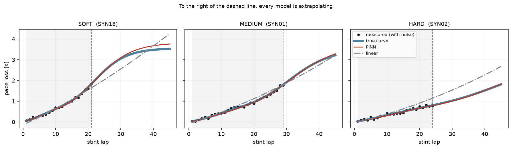
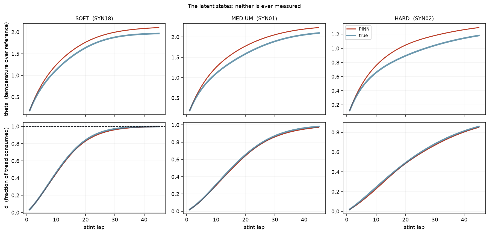

# PINN de degradación de neumáticos — v0

**Implementación inicial.** Una red neuronal a la que se le imponen dos
ecuaciones diferenciales acopladas, aplicada a la degradación de un neumático de
Fórmula 1. Es el cimiento del proyecto: el mínimo que demuestra que el método
funciona, escrito para poder leerse entero de una sentada.

Sin frameworks de PINN — los residuos están escritos a mano con PyTorch — y con
dos fuentes de datos: un banco sintético donde se conoce la respuesta, y
telemetría real descargada de la API de Fórmula 1.

> ### ⚠ Las ecuaciones están puestas; las constantes no están calibradas
>
> Esta rama trae el **sistema acoplado completo**: la EDO térmica, la del
> desgaste, su realimentación y el observable con término de acantilado. Lo que
> **no** trae son los valores correctos de las doce constantes físicas: los que
> hay en `physics.py` son un punto de partida.
>
> Con ellos, `beta = 0,71` y **no hay acantilado** (el porqué está abajo).
> Calibrarlos es el trabajo, y hay una herramienta y una guía para hacerlo:
>
> ```bash
> python tune.py          # diagnostica las constantes sin entrenar nada
> ```
>
> **→ [TUNING.md](TUNING.md) es el manual.**

> La versión avanzada está en la rama `main`: la misma física, una temporada
> completa de resultados y nueve parámetros estimados. El camino de aquí hasta
> allí, paso a paso, está en [ROADMAP.md](ROADMAP.md).

> **El código está en inglés** (identificadores, comentarios y salida por consola), igual que en `main`, para que pasar de una rama a otra no obligue a traducir nada. Este README, el ROADMAP y la guía de ajuste siguen en castellano.
> La referencia función por función está en [DOCS.md](DOCS.md).



*Los tres compuestos. La zona gris es lo que el modelo vio; a la derecha de la
línea discontinua todos los modelos extrapolan. La curva roja del PINN queda
encima de la curva verdadera (azul).*

---

## 1. La idea, en cuatro pasos

Una red neuronal es una función parametrizada, `d = N(τ, contexto ; W)`, y
entrenarla es buscar los pesos `W` que minimizan una pérdida. Lo que convierte
eso en un PINN es una sola observación:

1. La diferenciación automática puede derivar la salida de la red **respecto a
   sus entradas**, de forma exacta y barata.
2. Así que se puede calcular el **residuo** de cada ecuación diferencial que la
   física dice que se cumple: `r_d = dd/dτ − wear_rate(d, θ, contexto)` y
   `r_θ = dθ/dτ − thermal_rate(θ, d, contexto)`.
3. Evaluar ese residuo necesita **un punto del dominio y nada más**. No hace
   falta saber la respuesta correcta ahí.
4. Metiendo `r²` en la pérdida, la red obedece las ecuaciones — incluso en
   vueltas donde no hay ni un solo dato.

Aquí eso importa el doble, porque **`θ` no se mide en ninguna parte**: lo único
que sujeta la curva de temperatura es la ecuación.

El paso 3 es todo el truco. El término de física se exige en 2 000 puntos
repartidos hasta la vuelta 45, mucho más allá del stint más largo del conjunto,
y en combinaciones de condiciones que no se dieron en ninguna carrera.

## 2. El modelo físico

Dos EDO acopladas, cinco variables de contexto y un observable:

```
(E1)  dθ/dτ = A_gen·q_fric·(1 + ζ·d) − (h₀ + h₁·speed)·θ      la térmica

(E2)  dd/dτ = k(contexto, θ) · (1 − d)                         el desgaste

      k = kw · (load/load_ref)^m
             · exp( Ea·(track_temp − temp_ref + θ)
                  + Eq·(q_fric     − q_ref)
                  − Ev·(speed      − speed_ref)
                  − kappa·(compound − compound_ref) )

(E3)  δ(τ) = γ₁·d + γ₂·d⁸                                      el observable
```

**El tiempo y los dos estados**

- `τ` — tiempo adimensional del stint, `vuelta / 30`
- `θ` — temperatura de la goma por encima del estado de referencia, en las mismas unidades que `track_temp` (1 unidad = 40 °C) · **latente, nunca se observa**
- `d` — fracción de goma consumida, `0` nueva … `1` gastada · **latente, nunca se observa**

**El contexto** (constante dentro de un stint)

| Nombre en el código | Qué es | Efecto |
|---|---|---|
| `q_fric` | energía de fricción por vuelta | más energía → más calor y más desgaste |
| `load` | carga mecánica media en g | ley de Archard: `load^m` |
| `speed` | velocidad media | más aire → más refrigeración → **menos** desgaste |
| `track_temp` | temperatura del asfalto | activación térmica |
| `compound` | 0 blando … 1 duro | más duro → **menos** desgaste |

**Lo único que se mide**

- `δ` — pérdida de ritmo en segundos contra la mejor vuelta del stint

### El acantilado no está escrito en ninguna parte: emerge

La pieza decisiva de E1 es el factor **`(1 + ζ·d)`**.

Cuando la banda de rodadura adelgaza, la *misma* energía de fricción se deposita
en *menos* masa de goma, así que la temperatura sube. Y por el término de
Arrhenius de E2, más temperatura significa más desgaste — que adelgaza más la
banda, que sube más la temperatura. Es **realimentación positiva**, y el
acantilado sale de ese bucle. En ninguna línea del código pone «cae después de
la vuelta N».

La versión anterior de este modelo tenía solo E2 con `θ` congelada en cero. Con
una ecuación y un observable lineal, la curva de ritmo solo puede doblarse en un
sentido: se aplana y nunca se empina. Un neumático real no hace eso.

E3 afila el mismo fenómeno en el observable: `γ₂·d⁸` es despreciable mientras
`d` es moderado y domina cuando `d → 1`. El exponente 8 no se ajusta; está
elegido para que el término sea invisible hasta que la goma esté casi acabada.

### Las cuatro decisiones que cargan con el peso

**`θ` comparte `Ea` con `track_temp`.** Físicamente, la activación de Arrhenius
depende de la temperatura *absoluta* de la goma, que es el calor de la pista más
el que ha generado la fricción; separarlas en dos coeficientes sería afirmar que
un grado que viene del asfalto gasta distinto que un grado que viene del
rozamiento. Pero además es lo que **fija la escala de `θ`**: como nadie la mide,
el modelo podría encoger `θ` y agrandar `Ea` en el mismo factor sin que se note.
Al estar `Ea` atado también a `track_temp`, que sí se mide, esa salida se cierra.
Es la decisión estructural más importante del archivo.

**El factor `(1 − d)`** acota `d` a `[0, 1]` **estructuralmente**: no puedes
gastar más goma de la que hay. Y como mantiene la velocidad no negativa —la
realimentación térmica no cambia eso—, la monotonía sale de la propia ecuación.
El acantilado es un **empinamiento**, nunca una inversión.

**Restar una referencia en cada término** hace que `kw` signifique
literalmente *la velocidad de desgaste en condiciones normales*. No es
cosmética: sin centrar, `kw` y `Ev` se pisan. Está medido en este mismo
proyecto — sin centrar, `kw` salía con un 10 % de error y `Ev` con un 33 %,
pero la combinación `log(kw) − Ev` se recuperaba con un error de **0,0098**.
El modelo sabía perfectamente cuánto se gastaba el neumático; lo que no sabía
era a cuál de las dos constantes atribuirlo.

**`γ₁` y `A_gen` se fijan, no se estiman.** Las dos son direcciones degeneradas:
moverte por ellas cambia el estado latente y deja el observable idéntico, así que
ningún dato puede elegir un punto y el optimizador se desliza hasta desbordar.
`γ₁` ancla la escala de `d`; `A_gen` la de `θ`. En `main` esta misma degeneración,
sin cerrar, hizo divergir un entrenamiento hasta un RMSE de miles de millones de
segundos **con la pérdida de entrenamiento baja**.

### El número que decide si puede haber acantilado

Como `θ` se estabiliza mucho más rápido de lo que se gasta la goma, sustituyendo
su valor de equilibrio en E2 todo se derrumba en:

```
dd/dτ = k₀ · exp(β·d) · (1 − d)      con   β = Ea·A_gen·q_fric·ζ / (h₀ + h₁·speed)
```

El desgaste **acelera** —que es literalmente lo que es un acantilado— exactamente
mientras `β·(1 − d) > 1`, o sea mientras `d < 1 − 1/β`. De ahí:

> **β ≤ 1 → no puede existir acantilado.** Ni débil ni tardío: ninguno. No hay
> entrenamiento que encuentre un fenómeno que las ecuaciones no saben escribir.

`kw` y `γ₂` solo cambian *cuándo* y *cuánto*. **β decide *si*.** Es lo primero
que imprime `tune.py`, y con las constantes que vienen puestas vale 0,71.

### Lo que costó añadir E1

La solución exacta. Con `θ` en el bucle, `k` ya no es constante en el tiempo y no
hay forma cerrada. Lo que sobrevive es `exact_solution_isothermal`, exacta **solo**
con `A_gen = 0`: eso apaga la generación, `θ` se queda en cero y el sistema vuelve
a ser la única ecuación que sí tiene respuesta escrita a mano. Existe para una
cosa —validar el integrador RK4, que ahora es la única vía a la verdad— y ahí
coincide con un error de **3,05 × 10⁻¹²**:

```bash
python tune.py --check-integrator
```

## 3. Qué hay dentro

| Fichero | Qué contiene |
|---|---|
| `physics.py` | Las dos EDO, el observable, la solución isoterma y un integrador RK4 |
| `data.py` | De dónde salen los stints: generador sintético **o** lector del CSV |
| `download_data.py` | **Descarga telemetría real de la API y la deja en un CSV** |
| `pinn.py` | El PINN en PyTorch puro: red, residuos, colocación, entrenamiento |
| `baseline.py` | El modelo lineal clásico contra el que se compara |
| `evaluate.py` | RMSE, MAE, violaciones de monotonía y **vuelta del acantilado** |
| `run.py` | Entrena, evalúa y dibuja |
| `tune.py` | **Banco de calibración: diagnostica las constantes sin entrenar** |
| `TUNING.md` | **La guía para elegir los valores** |
| `DOCS.md` | Referencia completa: cada función, qué hace y cómo funciona |

La red es un perceptrón de `6 → 64 → 64 → 64 → 64 → 2` con `tanh`:
**13 058 pesos**. Se puede cambiar sin tocar código con `--width` y `--layers`.
Son dos salidas, `(θ, d)`, y **una sola red** para las dos: los estados están
acoplados, así que las características que explican uno explican en gran parte
el otro, y compartir las capas ocultas las aprende una vez en lugar de dos.

La pérdida tiene cuatro términos:

| Término | Bandera | Qué impone | Dónde |
|---|---|---|---|
| desgaste | `--w-physics` | residuo de E2 | 2 000 puntos de colocación, haya datos o no |
| térmica | `--w-thermal` | residuo de E1 | los mismos puntos |
| datos | `--w-data` | ajuste al ritmo medido | solo vueltas observadas |
| condición inicial | `--w-ic` | `θ(0) = d(0) = 0` | en `τ = 0` — **ignorado con `--ic hard`** |

Los pesos **son escalas, no importancias**, y `--w-thermal` está separado por una
razón medible: `dθ/dτ` es del orden de `A_gen` (unidades) mientras `dd/dτ` es del
orden de `kw` (una fracción). En la primera iteración de una corrida real el
residuo térmico nace **1700 veces más grande**. TUNING.md sección 5 lo detalla.

**Las condiciones iniciales van impuestas por transformación de la salida**
(`--ic hard`, por defecto), no como término de pérdida:

```
θ(τ) = τ · N₀                      ⟹  θ(0) = 0 exacto
d(τ) = 1 − exp(−τ · softplus(N₁))  ⟹  d(0) = 0 exacto, y 0 ≤ d < 1 siempre
```

La segunda merece leerse dos veces: no solo fija `d(0)`, hace que la saturación
sea **estructural**. Tres modos de fallo eliminados por una línea, y sin perder
nada — toda curva que arranca en 0 y se queda por debajo de 1 se sigue pudiendo
escribir así. `--ic soft` conserva la formulación de libro de texto para que se
pueda medir la diferencia.

Y **diez constantes físicas** se estiman junto con los pesos de la red: un
problema inverso completo. Se parametrizan de tres formas, y la elección codifica
lo que sabemos:

| Forma | Constantes | Por qué |
|---|---|---|
| `log(valor)` | `kw, m, Ea, Eq, Ev, zeta, h0, h1` | No existe un coeficiente de desgaste ni un ritmo de enfriamiento negativos. Para `h0` además: con `h0 ≤ 0` la ecuación térmica es inestable y `θ` se dispara |
| libre | `kappa` | La única cuyo signo **no** está fijado por la física: hay análisis que sostiene que 2026 invirtió el orden de los compuestos |
| caja con sigmoide | `gamma2` | La peor identificada: solo llega al observable con `d → 1`, y los equipos paran antes. La caja afirma algo que sí sabemos: un neumático destruido cuesta unos segundos por vuelta, no millones |

## 4. Cómo correrlo

```bash
pip install -r requirements.txt
```

### Primero: calibrar las constantes

**Antes de entrenar nada.** Las constantes de `physics.py` describen el mundo que
simula el banco sintético, y entrenar contra un mundo que no se comporta como un
neumático no le enseña nada útil a la red.

```bash
python tune.py                                  # diagnostica lo que hay puesto
python tune.py --Ea 2.8 --A_gen 2.1 --zeta 2.5  # prueba otros valores
python tune.py --sweep zeta 0.5 4.0 8           # un mando, ocho valores
python tune.py --plot outputs/tuning.png        # mira la forma, no solo las cifras
python tune.py --check-integrator               # valida RK4
```

No entrena nada y tarda segundos. Lo último que imprime es el bloque exacto para
pegar en `TireParams`. **El manual completo está en [TUNING.md](TUNING.md).**

### Con datos sintéticos

```bash
python run.py                     # 48 stints, 8 000 iteraciones, ~1 min en CPU
python run.py --quick             # versión corta para comprobar que arranca
python run.py --width 96 --layers 5 --iterations 15000   # red más grande

python run.py --w-thermal 0.02    # reequilibra la pérdida (ver más abajo)
python run.py --lbfgs 400         # fase de refinado tras Adam
python run.py --ic soft           # la formulación de libro de texto, para comparar
```

### Con datos reales

Primero se descargan, y quedan en un CSV que puedes abrir en Excel:

```bash
# Una carrera
python download_data.py --year 2023 --races Monza --out data/monza.csv

# Varias, que es lo recomendable: con una sola, las condiciones apenas varían
python download_data.py --year 2023 \
    --races Monza Hungary Spa Silverstone \
    --out data/2023.csv

# Prueba rápida sin telemetría: segundos en vez de minutos
python download_data.py --year 2023 --races Monza --no-telemetry \
    --out data/quick.csv
```

Y después se entrena con ellos:

```bash
python run.py --source csv --csv data/2023.csv

# Solo con algunos pilotos (mayúsculas o minúsculas, da igual)
python run.py --source csv --csv data/2023.csv --drivers VER HAM
```

**`--drivers` está en los dos programas y no hace lo mismo.** En
`download_data.py` filtra lo que se descarga; en `run.py`, con qué se entrena.
Para comparar pilotos, descarga a todos una vez y filtra al entrenar: probar otro
piloto no cuesta otra descarga. Un código que no está en el CSV es un error que
lista los que sí están, no algo que se ignore en silencio.

Menos pilotos son menos stints. Un piloto en una carrera suele dar dos o tres, y
hacen falta al menos dos (uno para entrenar, otro para evaluar); con tan pocos,
el test es un solo stint y las cifras bailan de una semilla a otra. Para un
piloto, junta varias carreras. Y si entrenas a VER y a HAM por separado y
comparas las constantes, la diferencia mezcla piloto **y** coche.

`python download_data.py --explain-columns` explica de dónde sale cada columna
del CSV, y `--help` lista todas las opciones.

> **La primera descarga tarda.** Parsear la telemetría de una carrera lleva
> varios minutos, porque se baja y se deriva la de cada vuelta por separado.
> FastF1 cachea lo descargado en `cache/` (unos 200 MB), así que la segunda vez
> es mucho más rápida.

### Qué hace el descargador, y por qué

El problema de fondo es que **nada de lo que el modelo necesita es observable**.
La temperatura interna del neumático, la carga vertical y el estado de la banda
son datos propios de cada equipo. Lo público es la telemetría de a bordo y los
tiempos por vuelta. Así que las variables se reconstruyen:

- **`q_fric`** integrando `|a|·v` a lo largo de la vuelta.
- **`load`** como aceleración total media, en g.
- **La aceleración lateral no viene en la telemetría**: se reconstruye derivando
  dos veces la trayectoria GPS. Como eso amplifica el ruido, antes se suaviza con
  un filtro Savitzky-Golay cuya ventana se fija **en segundos y no en muestras**,
  porque FastF1 fusiona fuentes a 10 Hz y 4 Hz y la frecuencia efectiva cambia
  de una vuelta a otra.

Y hay dos correcciones sin las cuales los datos no sirven:

- **Combustible y evolución de pista.** El coche se hace más rápido a lo largo
  de la carrera por motivos que no son el neumático, y sin corregirlo eso tapa
  la degradación entera. Las dos causas no son separables entre sí, pero su
  suma sí se puede estimar: el script ajusta una pendiente por carrera
  controlando por piloto y por degradación. `--race-lap-effect` permite fijarla a
  mano.
- **El origen de la degradación es el pico, no la primera vuelta.** Un juego
  nuevo sale frío y se hace *más rápido* dos o tres vueltas antes de empezar a
  caer. El modelo es monótono por construcción y no puede representar eso, así
  que esas vueltas se descartan y `d = 0` se define en el pico. En `main` esta
  corrección llevó el RMSE de 2,82 s a 0,567 s.

## 5. Resultados

**Advertencia antes de la primera tabla:** estos números salen de las constantes
**sin calibrar** que vienen en `physics.py`. Describen un mundo concreto y
arbitrario. Están aquí para enseñar qué hace la maquinaria, no como una marca a
batir — cuando calibres, los tuyos serán otros.

### Por defecto: 48 stints, 8 000 iteraciones de Adam, ~2 min de CPU

```
python run.py
```

| Modelo | RMSE | MAE | ErrorMax | ViolDentro | ViolExtrap | Cliff |
|---|---|---|---|---|---|---|
| **PINN** | **0,061** | **0,046** | **0,221** | **0,0 %** | **0,0 %** | 0 % |
| Lineal clásico | 0,143 | 0,104 | 0,473 | **8,6 %** | **4,0 %** | 0 % |

*ViolDentro / ViolExtrap = % de vueltas en las que el modelo predice que el
neumático recupera agarre. Es imposible; el valor correcto es 0 %.*

**Aquí ya no empatan, y el motivo es interesante.** Con una sola EDO los dos
modelos daban prácticamente el mismo RMSE, porque a lo largo de 12–30 vueltas la
curva estaba suavemente doblada y una parábola ajusta muy bien una curva
suavemente doblada. Con la realimentación térmica la curva **cambia de
curvatura** dentro del stint, y la parábola ya no da: se le dispara el error
máximo y empieza a predecir que el neumático recupera agarre en el 8,6 % de las
vueltas. El PINN no lo hace nunca, y no por ajustar mejor: **tiene dentro una
ecuación que se lo prohíbe**.

La columna `Cliff` está en 0 % para los dos, y es correcto: con `β = 0,71` las
constantes puestas no producen ninguno. El PINN está reproduciendo fielmente un
mundo sin acantilado.

Recuperación de las diez constantes — **17,2 % de error medio**:

| Constante | Estimado | Real | Error | |
|---|---|---|---|---|
| `kw` | 0,4292 | 0,4500 | 4,6 % | llega directa al observable |
| `m` | 1,6128 | 1,5000 | 7,5 % | |
| `Ea` | 0,8677 | 0,9500 | 8,7 % | |
| `Eq` | 0,3914 | 0,4000 | 2,2 % | |
| `Ev` | 0,3287 | 0,3500 | 6,1 % | |
| `kappa` | 0,8277 | 0,8500 | 2,6 % | |
| `zeta` | 0,3740 | 0,9000 | **58,4 %** | solo llega a través de `θ` |
| `h0` | 2,7857 | 4,0000 | **30,4 %** | idem |
| `h1` | 1,2233 | 2,0000 | **38,8 %** | idem |
| `gamma2` | 2,4819 | 2,2000 | 12,8 % | solo actúa con `d → 1` |



*Arriba `θ`, abajo `d`. Ninguna de las dos se mide jamás.*

**Esa figura es el diagnóstico, y conviene mirarla antes que el RMSE.** `d` está
recuperada casi perfectamente en los tres compuestos —el rojo tapa al azul— pero
`θ` sale sistemáticamente **alta**. Es la firma visual de lo que dice la tabla:
la red acierta los segundos compensando con `zeta` y `h0` demasiado bajas, que
producen una trayectoria de temperatura distinta pero un `d` correcto. En
segundos el ajuste es excelente; por dentro, el neumático que el modelo imagina
corre más caliente que el real.

Eso es exactamente lo que `04_state.png` existe para enseñar, y lo que ninguna
métrica de error puede.

El patrón es la mitad de la historia del proyecto: **las seis constantes del
desgaste, que llegan directas al observable, se recuperan entre el 2 % y el 9 %.
Las tres térmicas, que solo llegan a través de `θ`, están entre el 30 % y el
58 %.** Son las peor condicionadas del sistema: mueven `θ`, `θ` mueve el ritmo de
desgaste, el desgaste mueve `d`, y solo entonces pasa algo en segundos.

### Las dos palancas que mueven eso, medidas

Con todo lo demás igual, 3 000 iteraciones:

| corrida | error medio | qué cambia |
|---|---|---|
| por defecto | 16,3 % | `zeta` 52,9 %, `h1` 34,4 % |
| `--w-thermal 0.02` | **13,2 %** | `Ea` 10,5 → 3,5 %, `gamma2` 18,3 → 2,8 % |
| `--w-thermal 0.02 --lbfgs 400` | 14,6 % | `h1` 34,4 → **3,8 %**, `kw` → 0,1 %, pero `Ev` 2,4 → 22 % |

`--w-thermal` existe porque los dos residuos no viven en la misma escala: en la
primera iteración de una corrida real, `wear 0.03279` contra `heat 55.48579`. El
térmico nace **1700 veces más grande**, así que con el peso por defecto la red
dedica casi todo su esfuerzo a la ecuación que no tiene ni un dato que la sujete.

`--lbfgs` existe porque Adam, que escala cada parámetro por su propio historial
de gradiente, tiende a dejar las térmicas donde empezaron. Un método
cuasi-Newton usa la curvatura y sí las mueve. No es gratis: en la misma corrida
`Ev` empeoró.

### Pero la palanca grande no es de entrenamiento, es de física

`zeta` sigue clavada cerca de su valor inicial en las tres corridas de arriba. No
es el optimizador:

| | β = 0,71 (lo que viene puesto) | β = 1,94 |
|---|---|---|
| Subir `zeta` un 50 % mueve la curva de ritmo, como mucho | **0,469 s** | **1,445 s** |
| `zeta` aprendida (arranca en 0,50) | 0,350 → error **61 %** | 1,677 → error **24 %** |
| Error medio de las diez | 14,6 % | **8,6 %** |

Con `β` por debajo de 1 la realimentación apenas deja huella en lo único que se
mide, así que **no hay gradiente que seguir**. Los tres ajustes de entrenamiento
mueven la media unos pocos puntos; un ajuste de física la mueve casi el doble.

> **La lección que generaliza:** una constante solo es estimable si los datos
> cubren el régimen donde esa constante tiene efecto, y con una amplitud que
> destaque sobre el ruido. Calibrar la física no es cosmética — decide si el
> problema inverso tiene solución. Es el mismo problema que en `main` obligó a
> fijar siete de los nueve parámetros cuando se entrena con telemetría real.

### Y una comprobación que no depende de nada de lo anterior

```
python tune.py --check-integrator
```

Poniendo `A_gen = 0` el acoplamiento se apaga y el sistema vuelve a la única
ecuación con forma cerrada. RK4 coincide con ella con un error de
**3,05 × 10⁻¹²**. Si eso falla, todo lo demás está midiendo ruido.

## 6. Lo que esta versión NO hace

Está escrito para que se vea el hueco, no para disimularlo:

- **Las constantes no están calibradas.** Es lo primero y es deliberado: las
  ecuaciones son la entrega, los valores son tuyos. `python tune.py` te lo dice
  en la primera línea, y [TUNING.md](TUNING.md) es el manual.
- **Las tres constantes térmicas se recuperan mal** (30–58 % con las constantes
  actuales). Parte es condicionamiento y se ataca con `--lbfgs`; parte es que
  `β < 1` las hace casi invisibles, y eso solo se arregla calibrando.
- **`gamma2` está débilmente identificada por construcción.** Solo entra en juego
  con `d → 1` y los equipos paran antes. Es una limitación del problema, no del
  método.
- **La corrección de vuelta de carrera es una recta.** `main` ajusta un spline
  lineal a trozos, porque la forma de esa curva no tiene por qué ser lineal.
- **Sin baseline LSTM.** Aquí solo compite el modelo lineal clásico.
- **Sin datos reales de verdad probados de punta a punta.** El descargador está
  escrito y probado offline, pero los servidores de datos de F1 están bloqueados
  por la política de red del entorno donde se desarrolló, así que la llamada real
  a la API no se ha podido ejercitar.
