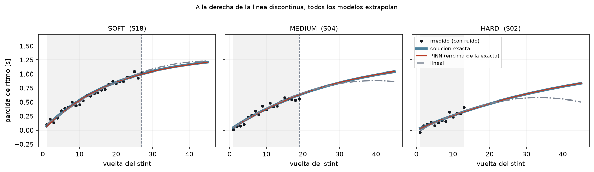
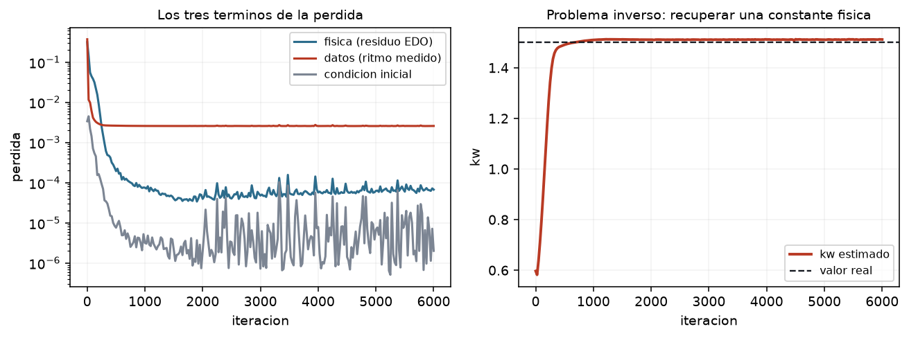

# PINN de degradación de neumáticos — v0

**Implementación inicial.** Una red neuronal a la que se le impone una ecuación
diferencial, aplicada a la degradación de un neumático de Fórmula 1. Es el
cimiento del proyecto: el mínimo que demuestra que el método funciona, escrito
para poder leerse entero de una sentada.

Unas 600 líneas, sin frameworks de PINN, sin datos reales. Corre en 30 segundos
en una CPU.

> La versión avanzada de este trabajo está en la rama `main`: dos EDO acopladas,
> nueve parámetros físicos estimados, telemetría real de FastF1 y una temporada
> completa de resultados. El camino de aquí hasta allí está en
> [ROADMAP.md](ROADMAP.md).



*Los tres compuestos. La zona gris es lo que el modelo vio; a la derecha de la
línea discontinua todos los modelos extrapolan. La curva roja del PINN queda
exactamente encima de la solución exacta (azul). El modelo lineal (gris) se
curva hacia abajo en MEDIUM y HARD: predice que el neumático **recupera**
agarre, que es imposible.*

---

## 1. La idea, en cuatro pasos

Una red neuronal es una función parametrizada, `d = N(τ, c ; W)`, y entrenarla
es buscar los pesos `W` que minimizan una pérdida. Lo que convierte eso en un
PINN es una sola observación:

1. La diferenciación automática puede derivar la salida de la red **respecto a
   sus entradas**, de forma exacta y barata.
2. Así que se puede calcular el **residuo** de la ecuación diferencial que la
   física dice que se cumple: `r = dd/dτ − tasa(d, c)`.
3. Evaluar ese residuo necesita **un punto del dominio y nada más**. No hace
   falta saber la respuesta correcta ahí.
4. Metiendo `r²` en la pérdida, la red obedece la ecuación — incluso en vueltas
   donde no hay ni un solo dato.

El paso 3 es todo el truco, y es el que explica el resultado de arriba: el
término de física se exige en 2 000 puntos repartidos hasta la vuelta 45,
mucho más allá del stint más largo del dataset.

## 2. El modelo físico

Una sola EDO, con un observable:

```
(E)   dd/dτ = k_w · exp(−κ·c) · (1 − d)

obs   δ(τ) = γ₁ · d
```

- `τ` — tiempo adimensional del stint, `vuelta / 30`
- `d` — fracción de goma consumida, `0` = nueva, `1` = gastada · **estado latente, nunca se observa**
- `c` — dureza del compuesto, `0` blando … `1` duro
- `δ` — pérdida de ritmo en segundos · **lo único que se mide**

El factor `(1 − d)` acota `d` a `[0, 1]` **estructuralmente**: no puedes gastar
más goma de la que hay. Y como mantiene la tasa no negativa, la monotonía (el
neumático nunca se regenera) sale de la propia ecuación, no de una restricción
añadida después. Esa es la razón de que el PINN saque 0 % de violaciones en la
tabla de abajo sin que nadie se lo pida explícitamente.

Este modelo tiene **solución analítica**: `d(τ) = 1 − exp(−k(c)·τ)`. Eso es
justamente lo que lo hace el punto de partida correcto — permite comprobar el
método contra una respuesta exacta antes de apuntarlo a un sistema donde no
existe ninguna.

## 3. Qué hay dentro

| Fichero | Qué contiene |
|---|---|
| `physics.py` | La EDO, el observable, la solución exacta y un integrador RK4 |
| `data.py` | Generador de stints sintéticos con ruido de cronometraje |
| `pinn.py` | El PINN, en PyTorch puro: red, residuo, colocación, entrenamiento |
| `baseline.py` | El modelo lineal clásico contra el que se compara |
| `evaluate.py` | RMSE y violaciones de monotonía |
| `run.py` | Entrena, evalúa y dibuja |

La red es un perceptrón de `2 → 32 → 32 → 1` con `tanh`: **1 185 pesos**. Es
minúscula a propósito. La física carga con la estructura, así que la red no
necesita capacidad para memorizar nada.

La pérdida tiene tres términos:

| Término | Qué impone | Dónde |
|---|---|---|
| `L_phys` | residuo de la EDO | 2 000 puntos de colocación, haya datos o no |
| `L_data` | ajuste al ritmo medido | solo vueltas observadas |
| `L_ic` | condición inicial `d(0) = 0` | en `τ = 0` |

Y una constante física, `k_w`, se estima **junto con** los pesos de la red: un
problema inverso en miniatura. Se parametriza como `log(k_w)` para que sea
positiva por construcción — no existe una tasa de desgaste negativa, y afirmarlo
desde la parametrización es más fuerte que confiar en que el optimizador lo
respete.

## 4. Cómo correrlo

```bash
pip install -r requirements.txt
python run.py              # 24 stints, 6 000 iteraciones, ~30 s en CPU
python run.py --quick      # version corta para comprobar que arranca
```

## 5. Resultados

24 stints sintéticos (18 entrenamiento / 6 test, **partidos por stint completo,
nunca por vuelta**), σ = 0,05 s de ruido de cronometraje.

| Modelo | RMSE [s] | MAE [s] | Viol. dentro | Viol. extrapolando |
|---|---|---|---|---|
| **PINN** | **0,053** | **0,044** | **0,0 %** | **0,0 %** |
| Lineal clásico | 0,054 | 0,045 | 0,0 % | 11,4 % |

Hay que leer esta tabla con cuidado, porque dice dos cosas distintas:

- **Dentro del rango medido están empatados.** Y tiene que ser así: sobre 12–30
  vueltas la curva verdadera es una curva suave, y una parábola ajusta una curva
  suave muy bien. Vender aquí una victoria del PINN sería vender ruido.
- **Extrapolando se separan.** El modelo lineal predice que el neumático recupera
  agarre en el 11,4 % de las vueltas del horizonte de decisión. El PINN, en el
  0 %. No porque sea "mejor", sino porque el factor `(1 − d)` de la ecuación se
  lo impide por construcción.

Esa segunda fila es el argumento entero del proyecto: la ventaja de meter física
en la red no aparece en el error medio, aparece en la coherencia cuando el
modelo tiene que responder fuera de lo que vio.

### El problema inverso



`k_w` arranca en 0,60 —deliberadamente equivocado— y converge a **1,5116**
frente al valor real de 1,5000: **0,8 % de error**, viendo únicamente tiempos
por vuelta con ruido. La red no solo ajusta una curva; mide el coeficiente de la
ley física que la genera.

El panel izquierdo tiene un detalle que vale la pena mirar: el término de datos
se estanca en ~2,6 × 10⁻³, que es exactamente la varianza del ruido
(0,05² = 2,5 × 10⁻³). No puede bajar más, y no debería: por debajo de ahí
estaría ajustando ruido. El término de física, en cambio, cae cuatro órdenes de
magnitud, porque la ecuación sí se puede satisfacer exactamente.

## 6. Lo que esta versión NO hace

Es una lista deliberada, no una lista de pendientes olvidados. Cada punto es un
paso concreto del [ROADMAP](ROADMAP.md):

- **No hay temperatura**, así que **no hay cliff.** Sin estado térmico no existe
  la realimentación (goma más fina → más caliente → se desgasta más rápido) que
  produce el colapso de agarre. La curva de esta versión solo puede doblarse en
  un sentido.
- **La condición inicial es un término de pérdida**, no una garantía. Se cumple
  aproximadamente, nunca exactamente, y compite por gradiente con los otros dos.
- **Un solo parámetro estimado.** Con nueve aparecen degeneraciones de escala
  que hacen divergir el ajuste, y hay que cerrarlas explícitamente.
- **Datos sintéticos.** Nada de esto ha tocado todavía una vuelta real.
- **Solo Adam.** Suficiente aquí; deja de serlo en cuanto hay parámetros
  térmicos.
